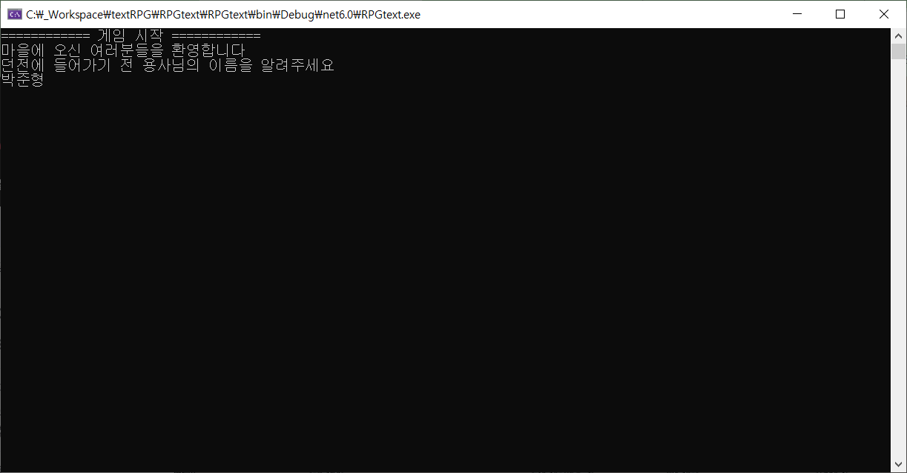
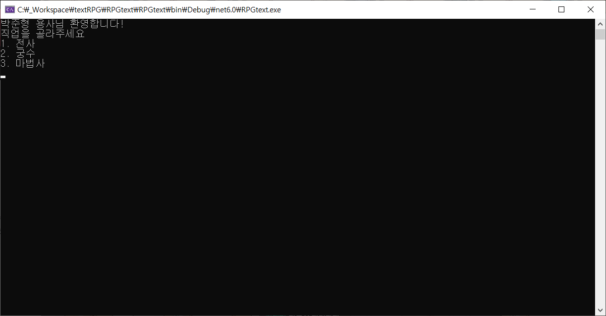
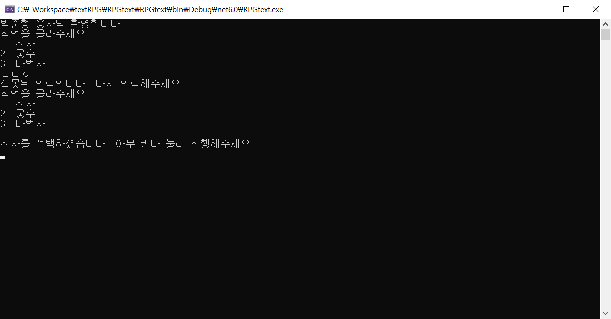
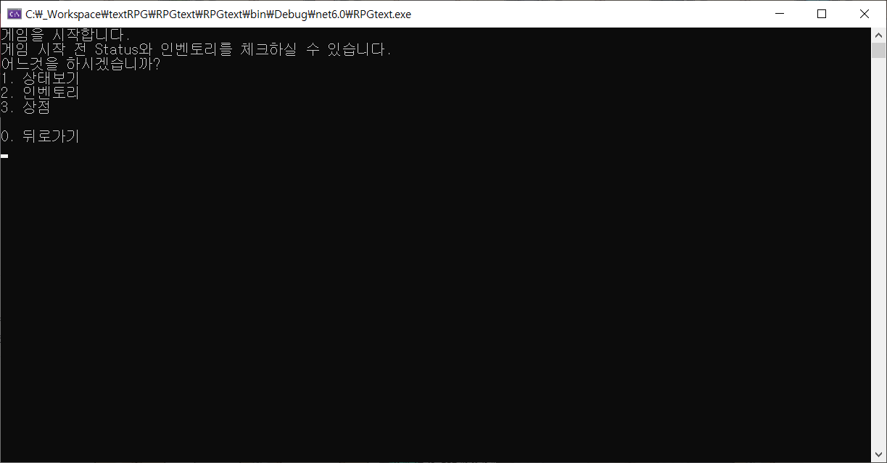
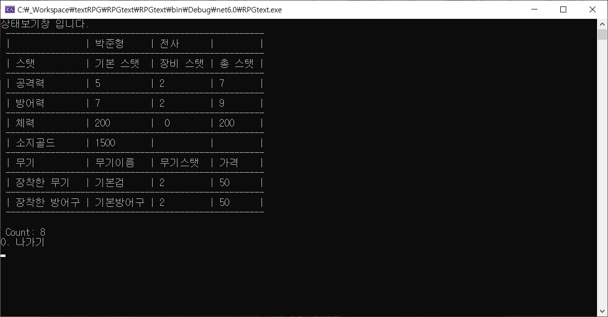
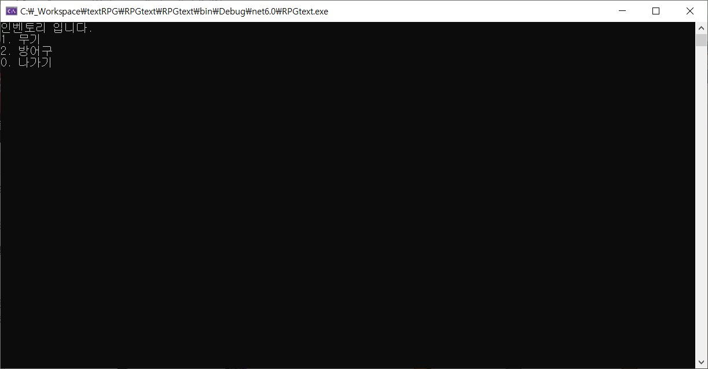
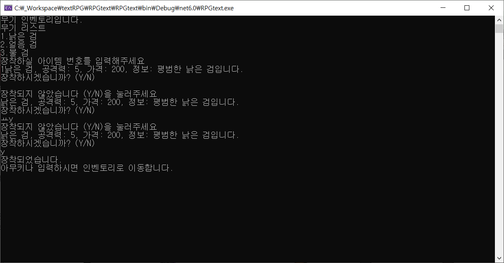
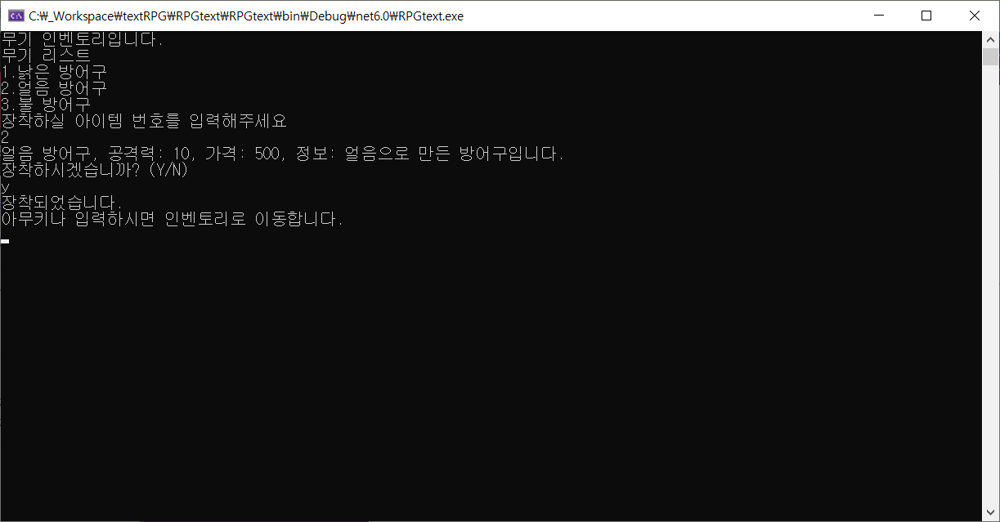
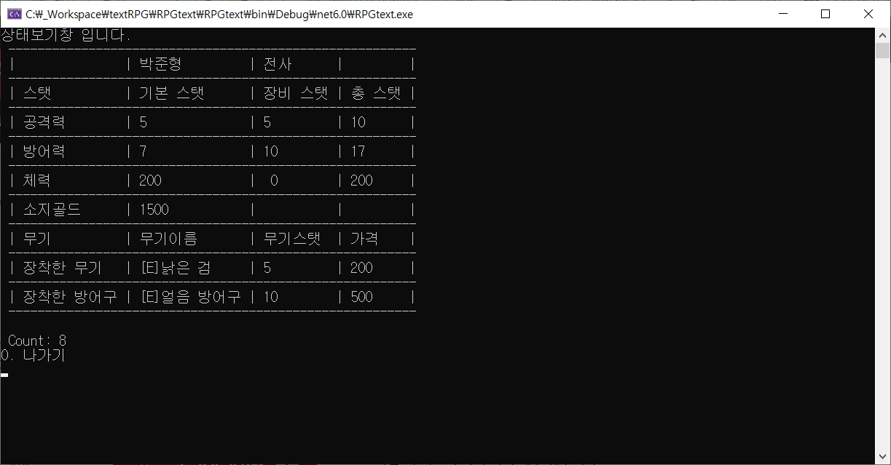

# TextRPG C#

 

> C# 콘솔로 만든 TextRPG입니다.  
> C#에 대한 이해도와 Class Inteface 활용을 연습하기 위해 시작한 프로젝트 입니다.  
> 프로젝트 개발기간은 2일이며, 이후 추가할 예쩡입니다.  
> 구현된 내용은 다음과 같습니다.

 

## 주요 기능
* 게임시작시 이름 정하기
* 클래스(직업) 정하기
* 상태, 인벤토리, 상점 탭 중 하나 선택
* 상태창에서는 이름, 직업, 현재 스테이터스, 소지골드 보여주기
* 인벤토리에서는 소지하고 있는 무기, 방어구를 보여주고, 장착 시 스테이터스 변화

## 기능 세부 설명
* 게임 시작 / 게임 시작 화면  
    * 플레이어 이름 작성  
    
* 직업 고르기
    * 전사, 궁수, 마법사 셋 중 하나 택  

* 스테이터스
    * 각 클래스(직업)별 스테이터스 출력
    * 인벤토리에서 장비 착용시, 적용

* 인벤토리
    * 무기 / 방어구로 구분
    * 번호 입력시 해당 장비 착용
    

##  기술 스택

## 구현한 기능

### 게임 화면

 __닉네임 정하기__  

 

* 게임 인트로 및 이름 입력창이 나오고 이름을 입력  
* 입력시 직업 선택 페이지로 넘어가고 입력했던 이름을 출력

 

__직업 선택__  

* 원하는 클래스 선택 가능
* 다른 키를 입력시 다시 입력해달라는 창 출력
* 선택 후 아무키나 누르면 진행가능

 

__인벤토리, 스테이터스__

* 상태보기, 인벤토리, 상점 중 택 1 가능
* 0번을 눌렀을 떄 뒤로가기 가능

 

__상태보기__

* 초기 스탯 표기
* ConsoleTable을 이용한 출력
* 이후 장비 착용시 스테이스 변화

 

__인벤토리__  

* 무기와 방어구 두 가지 선택지로 나눔

 

__무기 및 방어구__

 

* 무기 및 방어구 선택
* 잘못 입력시 재입력해달라는 내용 출력
* y를 누르면 장착이 가능하고 이후 인벤토리로 이동

 

__변화된 상태__

* 이후 스테이터스에 착용된 장비 만큼 스탯 적용
* 무기도 같이 출력

## 프로젝트 시 일어난 문제와 해결  

__문제__:   

swich 문으로 짧은 문구는 해결했으나, 상점을 구현하는 도중 item의 양이 많아지면 그만큼 스위치문이 길어지는 문제가 생김

__해결__:  

현재는 적용 안했으나 이후 적용할것은 TryParse를 통해 입력을 받고 나오는 수를 list와 비교하여 해당 list번호를 가져올 예정, 길어진 swich문을 짧게 해결할 수 있음

## 프로젝트시 힘들었던 점 및 소감

class와 interface로 나뉘는 것이 힘들었고, 프로퍼티 사용도 아직 미숙하여 어려움을 느꼈다. 그리고 완성 이후에 지저분한 코드가 많아 정리하고 싶다는 생각이 들었다.  

어려운 점도 많았지만, 차차 배워나가면서 더 성장하여 좋은 작품을 남기고 싶다.

